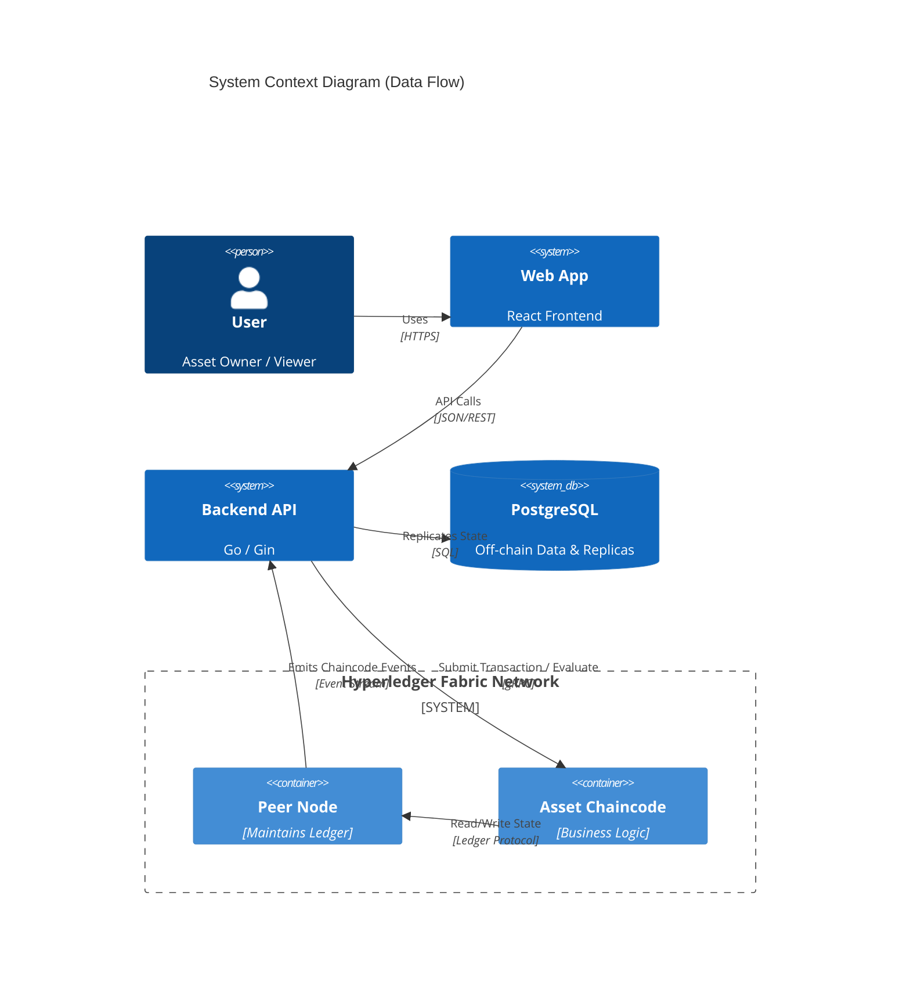
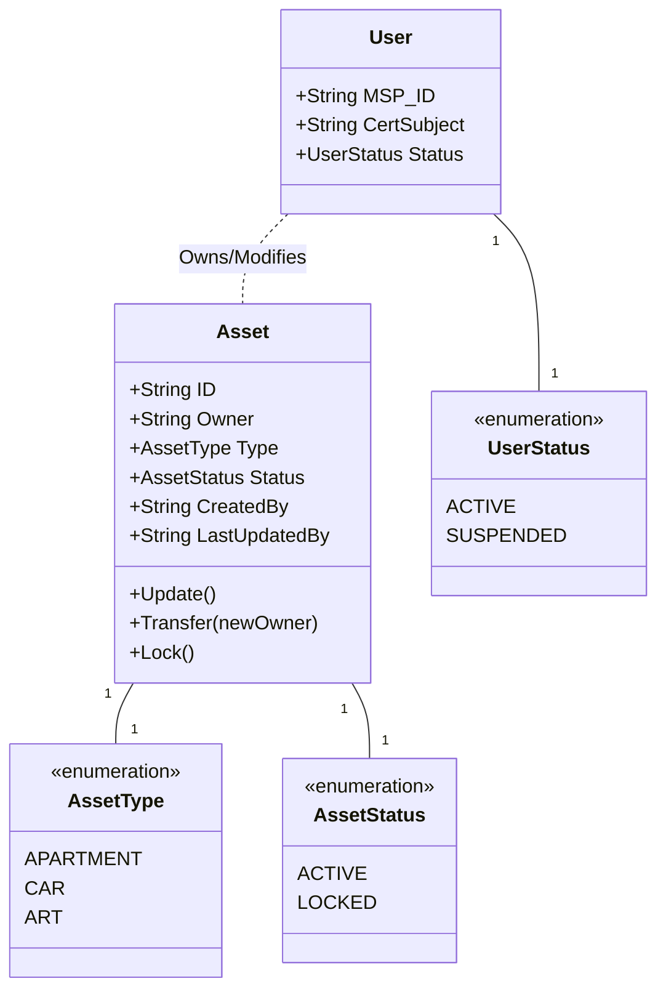
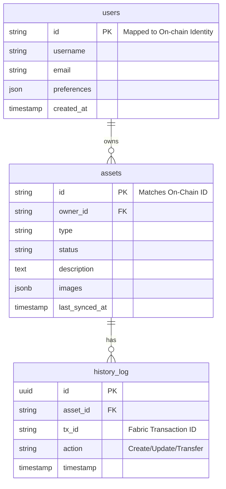

# Data Architecture & Models

## 1. Overview

The Asset Management System employs a **Hybrid Data Architecture** that leverages the strengths of both differentiated ledger technology and relational databases.

-   **On-Chain (Hyperledger Fabric)**: Serves as the **Single Source of Truth** for asset ownership, state, and provenance. It allows for immutable tracking and secure transfers.
-   **Off-Chain (PostgreSQL)**: Acts as a **Query Layer** for complex analytics, rich metadata storage (e.g., images), and high-performance read operations.

## 2. Data Models

### 2.1 Asset
The `Asset` is the core entity managed by the system. It represents physical items such as Apartments, Cars, or Art.

| Layer | Field | Type | Description |
|-------|-------|------|-------------|
| **On-Chain** | `ID` | String | Unique identifier for the asset. |
| **On-Chain** | `Owner` | String | MSP ID or Subject identifying the current owner. |
| **On-Chain** | `Type` | Enum | Classification: `APARTMENT`, `CAR`, `ART`, `PEN`, etc. |
| **On-Chain** | `Status` | Enum | `ACTIVE` (Transferable) or `LOCKED` (Frozen by Admin). |
| **Audit** | `CreatedBy` | String | Identity of the creator. |
| **Audit** | `LastUpdatedBy` | String | Identity of the last modifier. |
| **Off-Chain** | `Images` | URL[] | Links to asset images stored in blob storage. |
| **Off-Chain** | `Description` | Text | Long-form description and marketing copy. |

### 2.2 User
Users are actors within the system. Their primary identity is cryptographic, but an application-level profile is maintained off-chain.

| Layer | Field | Type | Description |
|-------|-------|------|-------------|
| **On-Chain** | `MSP_ID` | String | The Organization ID (e.g., `Org1MSP`). |
| **On-Chain** | `CertSubject` | String | The X.509 Certificate Subject (CN). |
| **On-Chain** | `Status` | Enum | `ACTIVE` or `SUSPENDED` (Revoked access). |
| **Off-Chain** | `Username` | String | Human-readable display name. |
| **Off-Chain** | `Email` | String | Contact email for notifications. |
| **Off-Chain** | `Preferences` | JSON | UI themes, notification settings, etc. |

### 2.3 Access Control (On-Chain)
-   **Asset Owner**: Can `Update` or `Transfer` their own assets (if Status is `ACTIVE`).
-   **Admin / Manager**:
    -   Can `Lock` any asset (set Status to `LOCKED`).
    -   Can `Suspend` any user (set User Status to `SUSPENDED`).

## 3. Storage Architecture

### On-Chain Storage (Fabric)
-   **World State (CouchDB/LevelDB)**: Stores the *current* value of an asset. Fast key-value lookups.
-   **Blockchain (Ledger)**: A sequential log of all transactions. Used to build the history and provenance.

### Off-Chain Storage (PostgreSQL)
-   **Synchronization**: A backend listener service subscribes to **Chaincode Events**. When a transaction is committed (e.g., `AssetCreated`, `AssetTransferred`), the service updates the SQL database.
-   **Usage**: The Frontend Dashboard queries this DB for lists, searching, and filtering to avoid ledger bottlenecks.

## 4. Diagrams

### 4.1 System Context (Data Flow)

### 4.2 Class Diagram (Chaincode)

### 4.3 Entity Relationship Diagram (Off-Chain DB)

